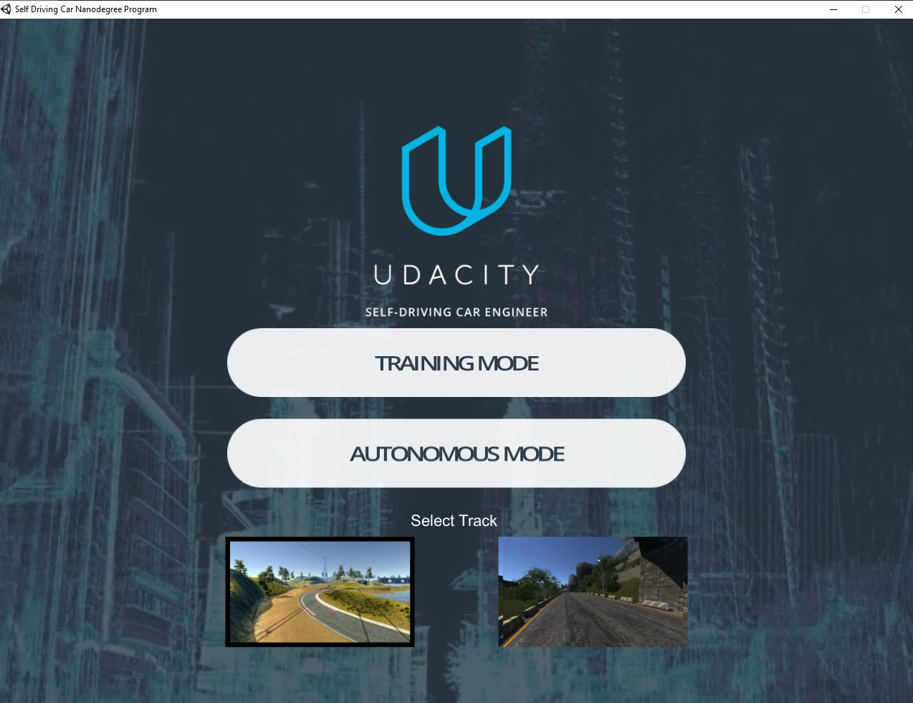
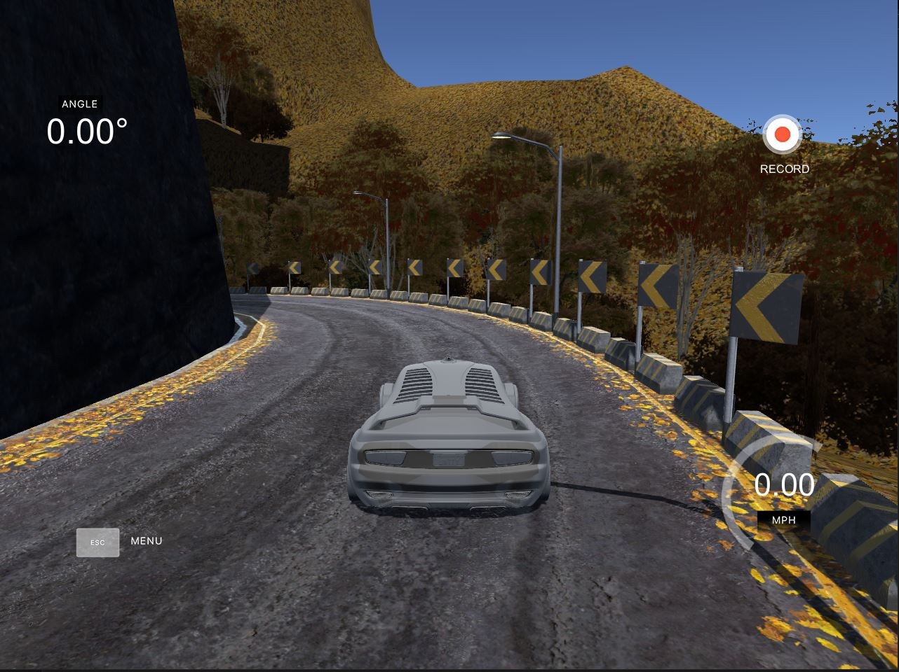

## Autonomuse-Vehicle-demo

### Steps

- Download Udacity-self-Driving-simulatore from here
    https://github.com/udacity/self-driving-car-sim choose version one 

- get training images from running the simulatore and record drivibg 

### Main Screen for the udacity simulater 

### here you need to chose training and record to get your data from it 

### One Of the tracks that you need to get your dataset from it 
