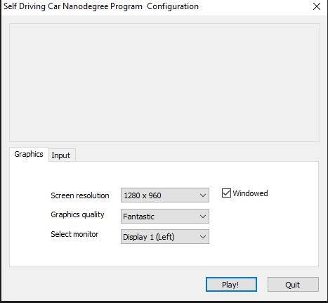

## Autonomuse-Vehicle-demo

### Steps

- Download Udacity-self-Driving-simulatore from [here](
    https://github.com/udacity/self-driving-car-sim) choose version one 

- get training images from running the simulatore and record drivibg 

### Main Screen for the udacity simulater 


### here you need to chose training and record to get your data from it 


### One Of the tracks that you need to get your dataset from it 


- if you do not want to play and record the tracks you 
 can download a dataset from this [here](https://github.com/rslim087a/track)

 - just run this command 
 ```bash
 git clone https://github.com/rslim087a/track

 ```

 to watch the vedio click the image 
[](https://youtu.be/469Us-w_avc)